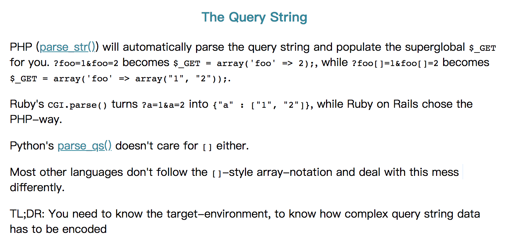

## URL QueryString 传数组参数

关于 URL QueryString 里传数组参数，为什么没有个规范呢？
导致每个平台都有自己的实现。目前我看到的有 3 种：

- a[0]=b&a[1]=c
- a[]=b&a[]=c
- a=b&a=c

参考自[ljharb/qs](https://github.com/ljharb/qs) 的文档，搜 arrayFormat 参数。

构造请求 3 种，解析请求 3 种，一共 9 种组合。做平台对接相关的工作，就很麻烦了。

参考自 http://medialize.github.io/URI.js/about-uris.html
